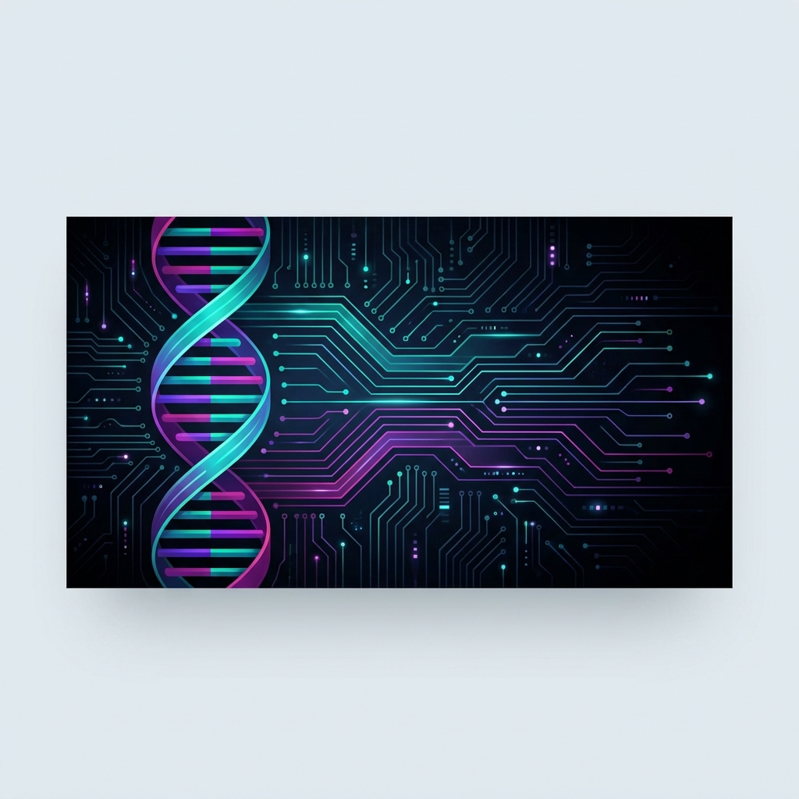

<p align="center">
  
</p>

# RNA Codon Optimization Pipeline

**AI-powered RNA sequence optimization using reinforcement learning and foundation models**

[](https://www.python.org/downloads/)
[](https://creativecommons.org/licenses/by-nc/4.0/)

## Overview

This pipeline optimizes RNA codon sequences for desired properties using:
- **Evo-1-8k** foundation model for RNA sequence embeddings
- **Multi-metric critic** predicting translation efficiency and mRNA half-life
- **LoRA** for parameter-efficient fine-tuning
- **PPO** for reinforcement learning-based optimization

## Features

✅ Multi-metric optimization (translation efficiency + mRNA half-life)  
✅ Cell line and tissue conditioning  
✅ Human codon usage frequencies  
✅ End-to-end pipeline from data to optimized sequences  
✅ Configurable via YAML  
✅ GPU + CPU support

## Quick Start

```bash
# Clone the repository
git clone https://github.com/ckr123tw/rna-codon-optimizer.git
cd rna-codon-optimizer

# Install dependencies
pip install -r requirements.txt

# Generate toy weights and data for testing
python scripts/generate_toy_weights.py

# Run training with toy data (mock model - no large downloads)
./run_training.sh --data_path data/toy_dataset.csv --model_name mock

# Run full pipeline with real Evo-1-8k model (requires ~16GB GPU)
./run_training.sh --data_path data/toy_dataset.csv
```

> **WSL Users:** The `run_training.sh` script automatically sets `LD_LIBRARY_PATH` to avoid GLIBCXX version errors common with Miniforge environments.

## Test Setup (Toy Data & Weights)

The repository includes scripts to generate toy artifacts for testing:

| Artifact | Location | Purpose |
|----------|----------|---------|
| Toy Dataset | `data/toy_dataset.csv` | 1800 samples with TE, Half-Life, cell lines & tissues |
| Toy Critic | `models/toy_critic.pt` | Pre-initialized critic model (~738K params) |
| Embedder Config | `models/toy_embedder_config.json` | Mock embedder configuration |

### For Real Training

Replace the following when you have actual data and compute:

| Component | Toy Version | Replace With |
|-----------|-------------|--------------|
| **Data** | `data/toy_dataset.csv` | Your TE/Half-life dataset (see Datasets section) |
| **Model** | `--model_name mock` | Remove flag to use real Evo-1-8k from HuggingFace |
| **Critic** | `models/toy_critic.pt` | Will be overwritten during training |
| **GPU** | CPU/small GPU | NVIDIA A100 40GB+ recommended for full training |

## Training Modes

### Mock Mode (Testing & Development)

Use mock mode to verify the pipeline works without downloading large models:

```bash
./run_training.sh --data_path data/toy_dataset.csv --model_name mock
```

**What happens in mock mode:**
- Embedder returns random 1024-dimensional vectors (no model download)
- LoRA adapter generates random nucleotide sequences
- Critic trains on these mock embeddings
- Full pipeline completes in ~30 seconds on CPU

**Use for:** Testing installation, verifying code changes, CI/CD pipelines

### Real Model Training

For actual RNA optimization, use the real Evo-1-8k foundation model:

```bash
# Activate your conda environment first
conda activate your_env

# Run with real model (downloads ~16GB model on first run)
./run_training.sh --data_path data/toy_dataset.csv
```

**Prerequisites for real training:**
1. Accept the [Evo-1-8k license on HuggingFace](https://huggingface.co/togethercomputer/evo-1-8k-base)
2. Log in to HuggingFace: `huggingface-cli login`
3. GPU with 40GB+ VRAM (A100, A6000) or use gradient checkpointing
4. Sufficient disk space for model cache (~20GB)

**Advanced options:**
```bash
# Custom training parameters
./run_training.sh \
    --data_path your_data.csv \
    --critic_epochs 10 \
    --ppo_epochs 5 \
    --learning_rate 1e-5
```

## Usage

```python
from src.pipeline import RNACodonOptimizationPipeline

# Initialize with multi-metric support
pipeline = RNACodonOptimizationPipeline(
    data_paths={
        'te': 'data/supplementary_table1.xlsx',
        'half_life': 'data/cetnar_half_life.xlsx'
    },
    metrics=['translation_efficiency', 'half_life']
)

# Train
pipeline.train_multi_metric_critic()

# Generate optimized sequence
result = pipeline.generate_optimized_sequence(
    utr5="AUGCUGACU...",
    utr3="UGACUGACU...",
    amino_acid_sequence="MYPFIRTARM",
    targets={
        'translation_efficiency': 5.0,
        'half_life': 4.5
    },
    cell_line="HEK293",
    metric_weights={'translation_efficiency': 0.6, 'half_life': 0.4}
)
```

## Hardware Requirements

**For 1-week training:**
- GPU: NVIDIA A100 (40GB) or A6000
- RAM: 64GB+
- Storage: 500GB SSD

**Cloud options:**  
Lambda Labs 8x A100: ~$12/hour

See [enhancement_plan.md](docs/enhancement_plan.md) for details.

## Datasets

**Translation Efficiency:** Zheng et al. 2025 ([DOI: 10.1038/s41587-025-02712-x](https://doi.org/10.1038/s41587-025-02712-x))  
**mRNA Half-Life:** Cetnar et al. 2024 ([DOI: 10.1038/s41467-024-54059-7](https://doi.org/10.1038/s41467-024-54059-7))

See `data/README.md` for download links.

## Project Structure

```
rna-codon-optimizer/
├── src/
│   ├── sequence_generation/  # Codon selection & Evo embeddings
│   ├── critic/               # Multi-metric prediction models
│   ├── lora_generation/      # LoRA-based generation
│   ├── ppo_training/         # PPO optimization
│   └── pipeline.py           # End-to-end integration
├── scripts/                  # All utility and training scripts
│   ├── train_ppo.py          # Main PPO training script
│   ├── generate_toy_weights.py  # Generate toy weights for testing
│   ├── create_toy_dataset.py    # Sample toy data from papers
│   ├── example_usage.py         # Example usage demo
│   ├── inspect_data.py          # Data exploration utility
│   └── inspect_tissue_data.py   # Tissue column classifier
├── data/                     # Datasets
├── models/                   # Checkpoints
├── configs/                  # YAML configuration
├── tests/                    # Unit tests
└── run_training.sh           # Training wrapper script
```

## Citation

If you use this pipeline, please cite:

```bibtex
@article{zheng2025predicting,
  title={Predicting the translation efficiency of messenger RNA in mammalian cells},
  author={Zheng, Dinghai and Persyn, Logan and Wang, Jun and Liu, Yue and Ulloa-Montoya, Fernando and Cenik, Can and Agarwal, Vikram},
  journal={Nature Biotechnology},
  year={2025},
  doi={10.1038/s41587-025-02712-x}
}

@article{cetnar2024predicting,
  title={Predicting synthetic mRNA stability using massively parallel kinetic measurements, biophysical modeling, and machine learning},
  author={Cetnar, Daniel P and Hossain, Ashraful and Vezeau, Gina E and Salis, Howard M},
  journal={Nature Communications},
  volume={15},
  number={1},
  pages={9601},
  year={2024},
  doi={10.1038/s41467-024-54059-7}
}
```

## License

**CC BY-NC 4.0** (Creative Commons Attribution-NonCommercial 4.0 International)

This work is licensed for **academic and non-commercial use only**. 

**You may:**
- ✅ Use for academic research
- ✅ Use for educational purposes
- ✅ Modify and distribute (with attribution)
- ✅ Use in non-profit organizations

**You may NOT:**
- ❌ Use in commercial products or services
- ❌ Use for commercial profit
- ❌ Use in for-profit companies without permission

**For commercial licensing**, please contact [your contact information].

See [LICENSE](LICENSE) file for full terms.

## Contact

For questions or issues, please open a GitHub issue or contact [your email].

## Acknowledgments

- Evo genomic foundation model by TogetherComputer
- Datasets from Zheng et al. 2025 and Cetnar et al. 2024
